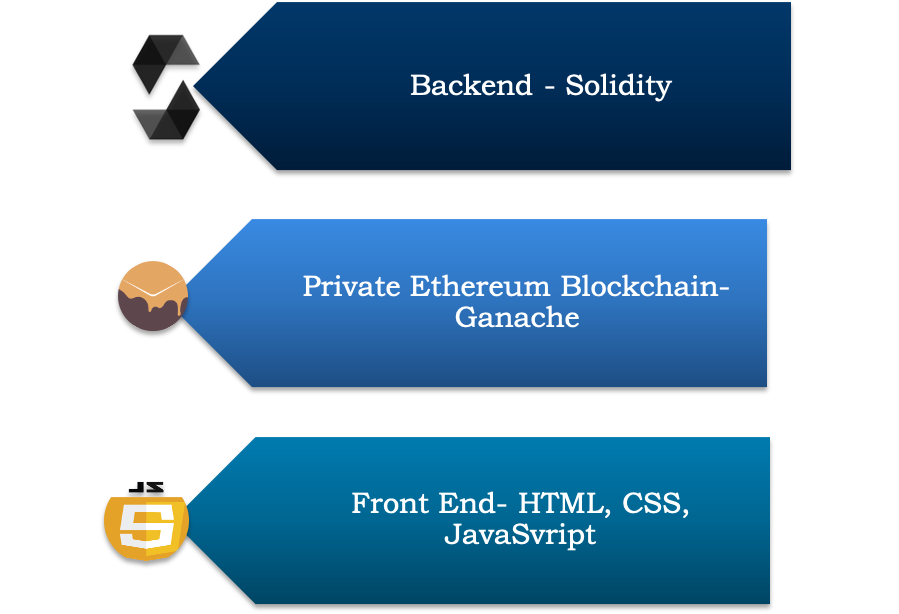

<h2>
	Supply Chain Using Ethereum Blockchain
</h2>

<h4>
	Table of Contents:
</h4>

<ul>
	<li> <a href="#intro">Introduction </a></li>
	<li> <a href="#tools">Tools Used </a></li>
	<li> <a href="#run">How to Run</a></li>
	<!--<li> <a href="#demo">Demo Video </a></li>-->
</ul>

<h3>
	Introduction:
</h3>

	<!--This is a course project made as a part of EECE 571G [ Software Engineering in Blockchain ] course at UBC. We plan to implement a supply chain system using blockchain as backend and reactjs for component based ui system. The system would be open for the Distributer, Retailer, Producer to see the information of any product that the relevant party might have dealt with. For a Vendor making products , For Example a Mobile maker, they can track the components , their price , their inventory, and who made the component of the product if they chose to offload it.-->
This is a course project made as a part of EECE 571G [ Software Engineering in Blockchain ] course at UBC. We have implemented a blockchain solution to create a decentralized market place. We have used Solidity programming language at the backend. The front end has been created using HTML, CSS and JavaScript. We are using the blockchain through Ganache. 

	The mail stakeholders in the project are:
	<ul>
		<li>Manufacturing Company</li>
		<li>Admin Company</li>
		<li>Distributor</li>
		<li>Retailer</li>
		<li>Customer</li>
</ul>

	The main pain point under consideration is that the customer can see the components and their manufacturer in order to circumvent fraud. Our project also tackles the problem of non-payment or ill timed payments to seller through our smart contracts. <!--	Similarly, for distributers and retailers, they can directly see the parties involved in supply chain. -->. The project will also focus on ownership transfer and profit distribution among the vendor , retailer and distributer.

<h3>
	Tools used: 
	
	</h3>
	

	<h3>How to run</h3>
	

	<h3>Team Members</h3>
	<ul>
	<li>Kritika Arora</li>
	<li>Rishab Madaan</li>
	<li>Garima Aggarwal</li>
	<li>Dinesh Pabbi</li>
	<li>Kunal Verma</li>
</ul>
